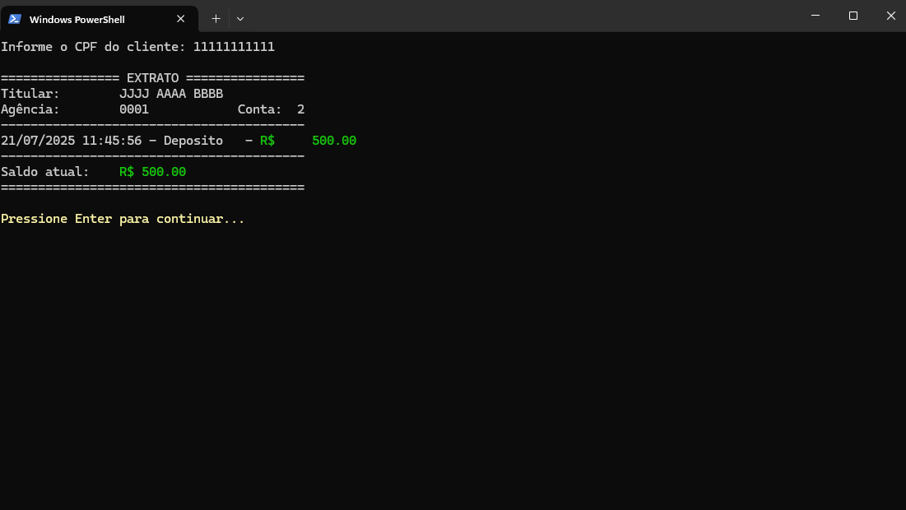

<a name="readme-top"></a>

<div align="center">
  
  [![Contributors][contributors-shield]][contributors-url]
  [![Forks][forks-shield]][forks-url]
  [![Stargazers][stars-shield]][stars-url]
  [![Issues][issues-shield]][issues-url]
  [![MIT License][license-shield]][license-url]

</div>
<br />
<div align="center">
  <a href="https://github.com/voaneves/simple-bank">
    
  </a>
  <h3 align="center">Simple Bank</h3>
  <p align="center">
    Um simulador de sistema bancário em Python, focado em código limpo e na aplicação prática dos 4 pilares da Programação Orientada a Objetos.
    <br />
    <a href="https://github.com/voaneves/simple-bank"><strong>Explore o código-fonte »</strong></a>
    <br />
    <br />
    <a href="https://github.com/voaneves/simple-bank/issues">Reporte um Bug</a>
    ·
    <a href="https://github.com/voaneves/simple-bank/issues">Sugira uma Funcionalidade</a>
  </p>
</div>

<details>
  <summary>Índice</summary>
  <ol>
    <li>
      <a href="#-sobre-o-projeto">Sobre o Projeto</a>
      <ul>
        <li><a href="#-tecnologias-utilizadas">Tecnologias Utilizadas</a></li>
      </ul>
    </li>
    <li>
      <a href="#-arquitetura-e-design-de-código">Arquitetura e Design de Código</a>
      <ul>
        <li><a href="#-princípios-da-programação-orientada-a-objetos-oop">Princípios da Programação Orientada a Objetos (OOP)</a></li>
        <li><a href="#-separação-de-responsabilidades">Separação de Responsabilidades</a></li>
      </ul>
    </li>
    <li>
      <a href="#-como-começar">Como Começar</a>
      <ul>
        <li><a href="#-pré-requisitos">Pré-requisitos</a></li>
        <li><a href="#-execução">Execução</a></li>
      </ul>
    </li>
    <li><a href="#-contribuindo">Contribuindo</a></li>
    <li><a href="#-licença">Licença</a></li>
    <li><a href="#-agradecimentos">Agradecimentos</a></li>
  </ol>
</details>

## 🏦 Sobre o Projeto

"Simple Bank" é uma aplicação de console desenvolvida em Python que simula as operações fundamentais de um sistema bancário. O projeto nasceu como um desafio técnico para aplicar e demonstrar, de forma clara e prática, os conceitos essenciais da engenharia de software e da programação orientada a objetos.

O objetivo não é ser um produto financeiro, mas sim um portfólio robusto que ilustra a habilidade de estruturar um código limpo, modular, documentado e de fácil manutenção, mesmo em uma aplicação de escopo definido. Ele serve como uma prova de conceito de como modelar um domínio do mundo real em código.

<div align="center">
  
</div>
<p align="center"><i>(Sugestão: tire um screenshot do seu terminal executando o programa e salve em <code>assets/img/screenshot.png</code>)</i></p>

### 🛠️ Tecnologias Utilizadas

Este projeto foi construído inteiramente com recursos nativos do Python, demonstrando a força da linguagem sem a necessidade de frameworks externos.

* **Python 3.8+**
* Módulos Nativos:
    * `os` e `sys` para interação com o sistema.
    * `datetime` para timestamp das transações.
    * `abc` para criação de classes abstratas.

<p align="right">(<a href="#readme-top">voltar ao topo</a>)</p>

## 🏛️ Arquitetura e Design de Código

A espinha dorsal do "Simple Bank" é sua arquitetura orientada a objetos. A estrutura foi pensada para ser extensível e testável, seguindo princípios de design consagrados.

### 💡 Princípios da Programação Orientada a Objetos (OOP)

Os quatro pilares da OOP são a fundação deste projeto:

1.  **Abstração:** Classes como `Transacao` definem um "contrato" genérico, forçando implementações concretas (`Saque`, `Deposito`) a terem uma interface comum. Isso torna o sistema mais flexível.
2.  **Encapsulamento:** Os atributos das classes (`_saldo`, `_transacoes`) são protegidos, e o acesso a eles é controlado por métodos e propriedades, garantindo a integridade dos dados.
3.  **Herança:** A classe `ContaCorrente` herda de uma `Conta` base, reutilizando código e adicionando funcionalidades específicas, como limites de saque, de forma limpa.
4.  **Polimorfismo:** O método `registrar()` de uma transação se comporta de maneira diferente dependendo se o objeto é um `Saque` ou um `Deposito`, permitindo que o sistema trate diferentes operações de forma uniforme.

### 🗂️ Separação de Responsabilidades

O código é organizado em camadas lógicas para maior clareza:

-   **Modelo (Model):** As classes (`Cliente`, `Conta`, `Transacao`, etc.) que representam os dados e as regras de negócio do banco. Elas são independentes da interface.
-   **Visão (View):** Funções simples (`exibir_mensagem`, `limpar_tela`) responsáveis por toda a interação visual com o usuário no terminal.
-   **Controle (Controller):** Funções (`executar_saque`, `criar_cliente`) que orquestram a interação entre a visão e o modelo, respondendo às entradas do usuário.

<p align="right">(<a href="#readme-top">voltar ao topo</a>)</p>

## 🚀 Como Começar

Para executar o projeto localmente, siga estes passos simples.

### ✅ Pré-requisitos

A única dependência é ter o Python 3 instalado em sua máquina.

* **Python 3**
    ```sh
    python --version
    ```

### ▶️ Execução

1.  Clone o repositório para sua máquina local.
    ```sh
    git clone [https://github.com/SEU-USUARIO/simple-bank.git](https://github.com/SEU-USUARIO/simple-bank.git)
    ```
2.  Navegue até a pasta do projeto.
    ```sh
    cd simple-bank
    ```
3.  Execute o script principal.
    ```sh
    python nome_do_arquivo.py
    ```
    *(Substitua `nome_do_arquivo.py` por `main.py` ou `simple_bank.py`)*

<p align="right">(<a href="#readme-top">voltar ao topo</a>)</p>

## 🤝 Contribuindo

Contribuições tornam a comunidade de código aberto um lugar incrível para aprender, inspirar e criar. Qualquer contribuição que você fizer será **muito bem-vinda**.

Se você tem uma sugestão para melhorar este projeto, por favor, faça um fork do repositório e crie um pull request. Você também pode simplesmente abrir uma issue com a tag "melhoria".

1.  Faça o Fork do Projeto
2.  Crie sua Feature Branch (`git checkout -b feature/FuncionalidadeIncrivel`)
3.  Faça o Commit de suas alterações (`git commit -m 'Adiciona alguma FuncionalidadeIncrivel'`)
4.  Faça o Push para a Branch (`git push origin feature/FuncionalidadeIncrivel`)
5.  Abra um Pull Request

<p align="right">(<a href="#readme-top">voltar ao topo</a>)</p>

## 📜 Licença

Distribuído sob a Licença MIT. Veja `LICENSE.txt` para mais informações.

<p align="right">(<a href="#readme-top">voltar ao topo</a>)</p>

## 🙏 Agradecimentos

Este projeto é um reflexo do aprendizado contínuo e foi inspirado por diversos recursos e comunidades.

* A comunidade Python, por sua vasta documentação e bibliotecas.
* Tutoriais e cursos online que forneceram a base de conhecimento.
* A todos que dedicam seu tempo para criar documentação e templates de qualidade, como o [Best-README-Template](https://github.com/othneildrew/Best-README-Template) que serviu de inspiração para esta estrutura.

<p align="right">(<a href="#readme-top">voltar ao topo</a>)</p>

[contributors-shield]: https://img.shields.io/github/contributors/voaneves/simple-bank.svg?style=for-the-badge
[contributors-url]: https://github.com/voaneves/simple-bank/graphs/contributors
[forks-shield]: https://img.shields.io/github/forks/voaneves/simple-bank.svg?style=for-the-badge
[forks-url]: https://github.com/voaneves/simple-bank/network/members
[stars-shield]: https://img.shields.io/github/stars/voaneves/simple-bank.svg?style=for-the-badge
[stars-url]: https://github.com/voaneves/simple-bank/stargazers
[issues-shield]: https://img.shields.io/github/issues/voaneves/simple-bank.svg?style=for-the-badge
[issues-url]: https://github.com/voaneves/simple-bank/issues
[license-shield]: https://img.shields.io/github/license/voaneves/simple-bank.svg?style=for-the-badge
[license-url]: https://github.com/voaneves/simple-bank/blob/main/LICENSE.txt
